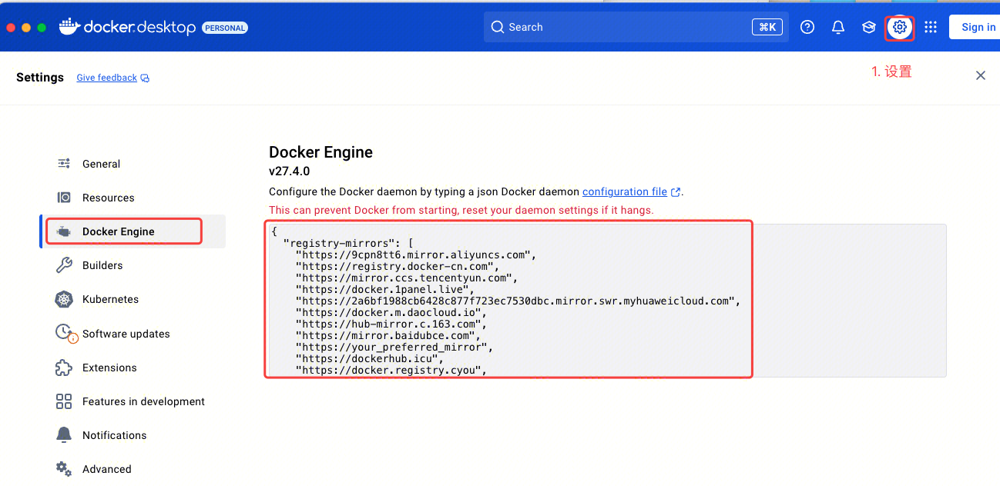

# Mac系统下安装使用Docker及Docker-Compose
## 一、安装DockerDesktop
## 二、下载代码
```bash
git clone git@github.com:langgenius/dify.git
cd dify
cd docker
cp .env.example .env
docker compose up -d

```
如果报错


```
{
"registry-mirrors":[
    "https://9cpn8tt6.mirror.aliyuncs.com",
    "https://registry.docker-cn.com",
    "https://mirror.ccs.tencentyun.com",
    "https://docker.1panel.live",
    "https://2a6bf1988cb6428c877f723ec7530dbc.mirror.swr.myhuaweicloud.com",
    "https://docker.m.daocloud.io",
    "https://hub-mirror.c.163.com",
    "https://mirror.baidubce.com",
    "https://your_preferred_mirror",
    "https://dockerhub.icu",
    "https://docker.registry.cyou",
    "https://docker-cf.registry.cyou",
    "https://dockercf.jsdelivr.fyi",
    "https://docker.jsdelivr.fyi",
    "https://dockertest.jsdelivr.fyi",
    "https://mirror.aliyuncs.com",
    "https://dockerproxy.com",
    "https://mirror.baidubce.com",
    "https://docker.m.daocloud.io",
    "https://docker.nju.edu.cn",
    "https://docker.mirrors.sjtug.sjtu.edu.cn",
    "https://docker.mirrors.ustc.edu.cn",
    "https://mirror.iscas.ac.cn",
    "https://docker.rainbond.cc"
    ]
}
```
通过 http://localhost/install 即可在本地打开
